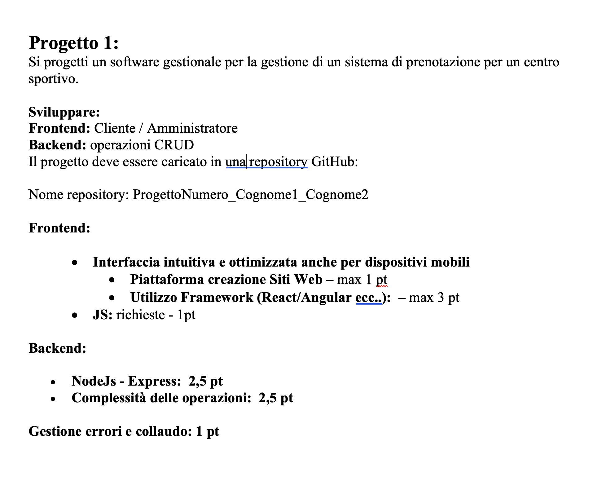

# Progetto1-Gilardi-Rischia

# Analisi del Progetto Centro Sportivo

## Struttura del Progetto
Il progetto è strutturato secondo un'architettura client-server, con una chiara separazione tra frontend e backend.

### Backend (server/)
La parte server del progetto è organizzata nei seguenti componenti:

- **server.js**: File principale che avvia il server
- **routes/**: Contiene le definizioni delle rotte API
- **controllers/**: Gestisce la logica di business delle richieste
- **middleware/**: Contiene i middleware per l'autenticazione e altre funzionalità trasversali
- **data/**: Gestione dei dati e modelli del database
- **scripts/**: Script di utilità e configurazione
- **.env**: File per la configurazione delle variabili d'ambiente

Tecnologie principali:
- Node.js come runtime
- Express.js come framework web
- Sistema di gestione delle dipendenze tramite npm

### Frontend (client/)
Il frontend è strutturato come segue:

- **public/**: Contiene file statici come index.html, che è il punto di ingresso dell'applicazione, e file di configurazione come manifest.json e robots.txt.
- **src/**: Contiene il codice sorgente dell'applicazione.
- **components/ **: Contiene componenti riutilizzabili come Navbar, ProtectedRoute, e form per le prenotazioni.
- **context/**: Contiene il contesto di autenticazione per gestire lo stato dell'utente.
- **pages/**: Contiene le diverse pagine dell'applicazione, come Home, Login, e AdminDashboard.
- **styles/**: Contiene i file CSS per la stilizzazione dell'applicazione.

Funzionalità Principali del frontend:
- **Autenticazione**: Gli utenti possono registrarsi, effettuare il login e cambiare la password. L'autenticazione è gestita tramite un contesto React (AuthContext), che fornisce lo stato dell'utente e le funzioni di login/logout.
- **Prenotazioni**: Gli utenti possono effettuare prenotazioni per diversi campi sportivi. La logica per la gestione delle prenotazioni è implementata nel componente PrenotazioneForm, che gestisce l'invio dei dati al backend.
- **Dashboard Amministrativa**: Gli amministratori possono visualizzare, modificare ed eliminare le prenotazioni. La dashboard è implementata nel componente AdminDashboard, che utilizza Axios per recuperare i dati dal backend.
- **Navigazione**: La navigazione tra le diverse pagine è gestita da React Router, che consente di passare facilmente da una pagina all'altra senza ricaricare l'intera applicazione.
- **Visualizzazione Calendario**: Gli utenti possono visualizzare le prenotazioni in un formato di calendario settimanale, che mostra la disponibilità dei campi.

Tecnologie principali:
- React: Una libreria JavaScript per costruire interfacce utente. Utilizza un approccio basato sui componenti, che consente di creare UI riutilizzabili e gestire lo stato in modo efficiente.
- React Router: Utilizzato per la gestione della navigazione tra le diverse pagine dell'applicazione.
- Axios: Una libreria per effettuare richieste HTTP, utilizzata per comunicare con il backend.
- Bootstrap: Un framework CSS per la creazione di interfacce responsive e moderne.
- Date-fns: Una libreria per la manipolazione delle date, utilizzata per gestire le date nelle prenotazioni.

## Architettura del Sistema

### Caratteristiche Principali
1. **Separazione delle Responsabilità**: Chiara divisione tra frontend e backend
2. **API RESTful**: Comunicazione client-server attraverso API REST
3. **Modularità**: Organizzazione del codice in componenti e moduli distinti
4. **Scalabilità**: Struttura che permette facili estensioni e modifiche

### Sicurezza
- Gestione delle variabili d'ambiente tramite file .env
- Middleware di autenticazione
- Separazione dei dati sensibili dalla logica di business

## Funzionalità Principali
1. Gestione degli utenti e autenticazione
2. Gestione delle prenotazioni
3. Amministrazione del centro sportivo

## Conclusioni
Il progetto presenta una struttura organizzata e modulare, che facilita la manutenzione e lo sviluppo. L'architettura client-server scelta permette una chiara separazione delle responsabilità e una gestione efficiente delle risorse. 

## Fonti Principali 
ChatGPT , [Reac](https://react.dev/) , le presentazioni e i progetti sviluppati in Js e JSon 
